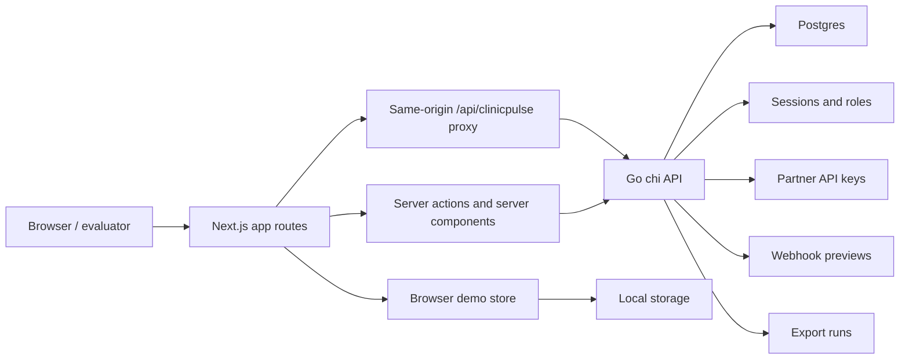

# Architecture

ClinicPulse is a full-stack demo product with a Next.js frontend, Go chi API, and Postgres database. The application is designed to show district clinic operations end to end: public discovery, authenticated district operations, field reporting, admin readiness, partner APIs, webhooks, exports, and audit history.

## System Diagram

## Runtime Components

| Component | Location | Responsibility |
| --- | --- | --- |
| Next.js app | `app/`, `components/`, `lib/` | Landing, booking, public finder, district demo, field report, admin, auth UI, browser demo state |
| Browser API proxy | `next.config.ts` | Rewrites `/api/clinicpulse/*` to the Go API base URL for same-origin browser calls |
| Go API | `services/api` | Health, public clinic data, auth, role-protected operations, reports, sync, admin readiness, account lifecycle, partner APIs |
| Postgres | Docker Compose and `services/api/migrations` | Clinic directory, service availability, reports, status, audit history, auth, partner readiness, sync metadata |
| Demo seed and fallback | `lib/demo`, migrations, local auth seed | Keeps the demo usable locally and in non-production fallback contexts |

## Request Flow

1. Browser routes load through the Next.js app.
2. Server components and server actions call the Go API with `CLINICPULSE_API_BASE_URL`.
3. Browser-side calls use `NEXT_PUBLIC_CLINICPULSE_API_BASE_URL`, normally `/api/clinicpulse`.
4. Next.js rewrites `/api/clinicpulse/*` to the Go API.
5. The Go API reads and writes Postgres.
6. The frontend demo store keeps local interaction state and can fall back to seeded data only when configured.

## Authentication And Authorization

Local demo users are seeded from `services/api/seeds/local_phase3_auth_users.sql`.
Local credential hints are shown only for local deployments that have not explicitly disabled demo fallback.
Staging and production must hide seeded credentials and keep public registration disabled.

Roles:

- `reporter`: field reporting.
- `district_manager`: field reporting and district console.
- `org_admin`: district console and admin readiness.
- `system_admin`: all seeded admin flows.

The Go router enforces auth and role boundaries through middleware in `services/api/internal/http`.
Session tokens are stored as hashes, cookies are rotated on login, and disabled or expired sessions are rejected by the auth middleware.
Users can change their own password after the current password is verified; the API stores only password hashes and clears the reset-required flag on successful password change.

Admin user lifecycle flows are handled through `/v1/admin/users` routes. `org_admin` can manage users inside the acting organisation scope, while `system_admin` can manage platform-level access. Creating a pilot user creates the user, membership, and audit event in one transaction and returns a one-time temporary password.

Unsafe cookie-authenticated mutations pass through trusted-origin CSRF checks and an in-process fixed-window mutation limiter. Login has its own generic throttle so callers cannot distinguish missing users, disabled users, bad passwords, or throttled attempts. The in-process limiter is acceptable for the current pilot-sized deployment, but should move to shared storage before multi-instance production scale.

## Data Flow By Workflow

| Workflow | Frontend route | Backend route group | Stored data |
| --- | --- | --- | --- |
| Public clinic finder | `/finder` | `/v1/public/*` | `clinics`, `clinic_services`, `current_status` |
| District console | `/demo` | `/v1/clinics`, `/v1/reports`, `/v1/sync` | reports, current status, audit events, sync attempts |
| Clinic detail | `/demo/clinics/[clinicId]` | `/v1/clinics/{clinicId}` and child routes | clinic profile, reports, audit events |
| Field reporting | `/field` | `/v1/reports`, `/v1/reports/offline-sync` | reports, sync attempts, audit events |
| Admin readiness | `/admin` | `/v1/admin/*` | user lifecycle, sessions, partner keys, webhooks, exports, integration checks |
| Partner integration | external partner client | `/v1/partner/*` | partner API keys, export runs, status data |

## Processing Evidence

Stale status reconciliation is safe to rerun: it only escalates freshness state and writes audit evidence for actual transitions. Offline sync attempts are stored in `report_sync_attempts` with duplicate, conflict, validation, and server-error outcomes for the sync summary and admin ingestion views. Partner export generation creates export-run evidence with checksums and record counts. Webhook tests always leave evidence: preview-only runs are recorded when delivery is disabled, and failed test evidence is recorded when delivery is enabled but no delivery implementation is available.

## Demo Fallback

`CLINICPULSE_ALLOW_DEMO_FALLBACK` controls whether API failures may fall back to seeded frontend demo state and whether local seeded credential hints are visible. This is useful for local demos. Production and staging must keep it disabled because operational failures and seeded access assumptions should be visible.

## Testing Boundaries

- Vitest covers frontend demo state, selectors, API clients, and UI helpers.
- Go tests cover store, service, auth, and HTTP behavior.
- ESLint covers Next.js and TypeScript quality.
- Next build verifies the production app compiles.
- Playwright smoke tests exercise route-level browser workflows against an isolated e2e database.
- `make verify-security` runs dependency and Go vulnerability checks.
