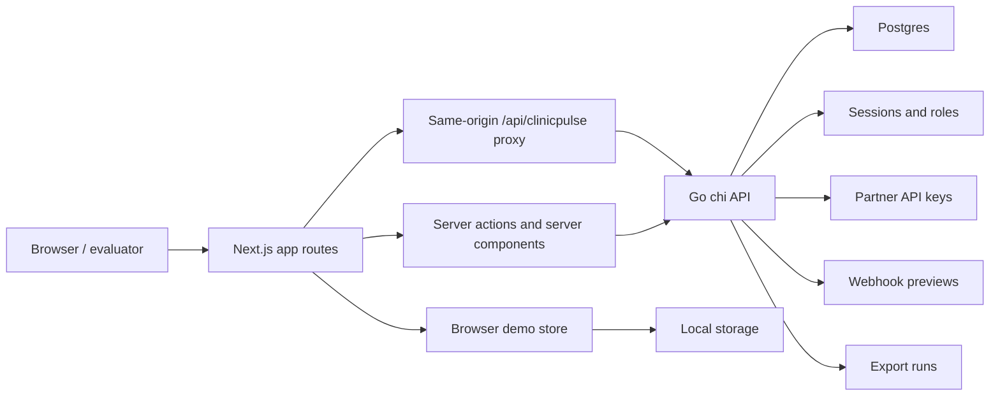

# Architecture

ClinicPulse is a full-stack demo product with a Next.js frontend, Go chi API, and Postgres database. The application is designed to show district clinic operations end to end: public discovery, authenticated district operations, field reporting, admin readiness, partner APIs, webhooks, exports, and audit history.

## System Diagram

## Runtime Components

| Component | Location | Responsibility |
| --- | --- | --- |
| Next.js app | `app/`, `components/`, `lib/` | Landing, booking, public finder, district demo, field report, admin, auth UI, browser demo state |
| Browser API proxy | `next.config.ts` | Rewrites `/api/clinicpulse/*` to the Go API base URL for same-origin browser calls |
| Go API | `services/api` | Health, public clinic data, auth, role-protected operations, reports, sync, admin readiness, partner APIs |
| Postgres | Docker Compose and `services/api/migrations` | Clinic directory, service availability, reports, status, audit history, auth, partner readiness, sync metadata |
| Demo seed and fallback | `lib/demo`, migrations, local auth seed | Keeps the demo usable locally and in non-production fallback contexts |

## Request Flow

1. Browser routes load through the Next.js app.
2. Server components and server actions call the Go API with `CLINICPULSE_API_BASE_URL`.
3. Browser-side calls use `NEXT_PUBLIC_CLINICPULSE_API_BASE_URL`, normally `/api/clinicpulse`.
4. Next.js rewrites `/api/clinicpulse/*` to the Go API.
5. The Go API reads and writes Postgres.
6. The frontend demo store keeps local interaction state and can fall back to seeded data when configured.

## Authentication And Authorization

Local demo users are seeded from `services/api/seeds/local_phase3_auth_users.sql`.

Roles:

- `reporter`: field reporting.
- `district_manager`: field reporting and district console.
- `org_admin`: district console and admin readiness.
- `system_admin`: all seeded admin flows.

The Go router enforces auth and role boundaries through middleware in `services/api/internal/http`.

## Data Flow By Workflow

| Workflow | Frontend route | Backend route group | Stored data |
| --- | --- | --- | --- |
| Public clinic finder | `/finder` | `/v1/public/*` | `clinics`, `clinic_services`, `current_status` |
| District console | `/demo` | `/v1/clinics`, `/v1/reports`, `/v1/sync` | reports, current status, audit events, sync attempts |
| Clinic detail | `/demo/clinics/[clinicId]` | `/v1/clinics/{clinicId}` and child routes | clinic profile, reports, audit events |
| Field reporting | `/field` | `/v1/reports`, `/v1/reports/offline-sync` | reports, sync attempts, audit events |
| Admin readiness | `/admin` | `/v1/admin/*` | partner keys, webhooks, exports, integration checks |
| Partner integration | external partner client | `/v1/partner/*` | partner API keys, export runs, status data |

## Demo Fallback

`CLINICPULSE_ALLOW_DEMO_FALLBACK` controls whether API failures may fall back to seeded frontend demo state. This is useful for local demos and non-production resilience. Production and staging should keep it disabled unless fallback is intentional, because operational failures should be visible.

## Testing Boundaries

- Vitest covers frontend demo state, selectors, API clients, and UI helpers.
- Go tests cover store, service, auth, and HTTP behavior.
- ESLint covers Next.js and TypeScript quality.
- Next build verifies the production app compiles.
- Playwright smoke tests exercise route-level browser workflows against an isolated e2e database.
