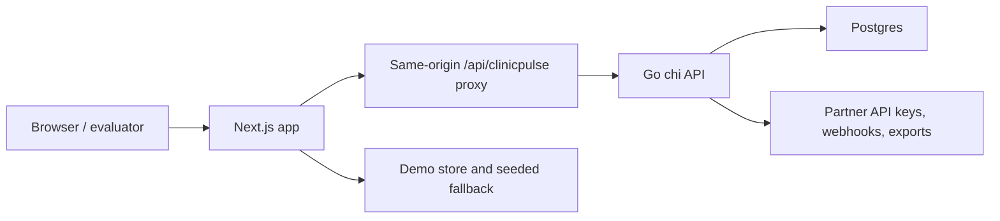

# ClinicPulse Showcase Package Design

Date: 2026-05-07

## Context

ClinicPulse already has a working Next.js demo surface, Go API, Postgres migrations,
local auth seed, frontend tests, backend tests, Playwright smoke coverage, and a
README that explains the current full-stack state. The repository now needs a
portfolio-ready showcase layer: a clean public-facing way to understand the demo,
run it quickly, inspect the architecture and API contracts, and see what still
requires external assets such as a deployed URL, screenshots, portfolio post, and
short demo video.

This spec is stored under `specs/` because this repository treats `docs/` and
`docs/superpowers/` as local-only ignored paths.

## Goals

- Make `README.md` the concise front door for evaluators, recruiters, and
  collaborators.
- Add a clean live-demo section with local demo credentials and an explicit
  placeholder for the eventual deployed demo URL.
- Document the system architecture with a diagram and component explanations.
- Document the API contract exposed by the Go router.
- Document the database schema at a high level without duplicating every SQL
  migration line.
- Add a "Run locally in 5 minutes" path that points to the existing Makefile
  workflow.
- Add an "Engineering decisions" section that explains the most important
  implementation choices and tradeoffs.
- Add screenshot, video, release, and portfolio case-study checklists so external
  assets have concrete production paths.
- Keep this pass documentation-focused and avoid changing application behavior.

## Non-Goals

- Deploying the live demo.
- Recording or editing the demo video.
- Capturing browser screenshots and committing binary images.
- Publishing a portfolio website.
- Creating the `v0.1.0-alpha` Git tag before the docs are implemented and
  verified.
- Adding a new public in-app showcase route.

## Recommended Approach

Use a repo-first documentation package.

The README should act as a polished index and quick-start page. Focused docs under
`docs/` should hold deeper material: architecture, API, database schema,
engineering decisions, screenshots, video script, release checklist, and portfolio
case study. External URLs and media assets should use clear placeholders rather
than fake links.

This approach gives the repository an honest professional handoff immediately,
while keeping future deployment, portfolio publishing, and video production as
explicit next steps.

## Documentation Architecture

Create or update these files:

- `README.md`: showcase front door, demo credentials, quick local setup, docs
  index, release status, and external-asset placeholders.
- `docs/architecture.md`: architecture diagram, request/data flow, frontend,
  backend, database, auth, demo fallback, and testing boundaries.
- `docs/api.md`: API reference grouped by health, auth, public, operational,
  admin, partner, report, sync, webhook, and export routes.
- `docs/database-schema.md`: schema overview grouped by clinics, services,
  reports, current status, audit events, auth, partner readiness, webhooks,
  exports, and sync.
- `docs/screenshots.md`: screenshot capture checklist for core workflows.
- `docs/demo-video.md`: short demo video outline, scenes, script beats, and
  capture checklist.
- `docs/portfolio-case-study.md`: case-study draft with problem, users, solution,
  architecture, workflows, engineering decisions, results, and next steps.
- `docs/engineering-decisions.md`: decision log for framework, API, persistence,
  auth, offline sync, demo fallback, testing, and release tradeoffs.
- `docs/release.md`: `v0.1.0-alpha` release checklist, verification commands,
  tag command, and release notes draft.

## README Design

The README should stay readable and avoid becoming a long reference manual.
Recommended sections:

- Project summary.
- Live demo placeholder and demo credentials.
- "Run locally in 5 minutes" with the shortest reliable path:
  `npm install`, `.env.local` copy, `make db-up`, `make db-bootstrap`,
  `make dev-api`, and `make dev-web`.
- Core workflows with direct route list:
  `/`, `/book-demo`, `/demo`, `/demo/clinics/clinic-mamelodi-east`, `/finder`,
  `/field`, and `/admin`.
- Documentation index linking to the new docs.
- Validation commands.
- Release status and `v0.1.0-alpha` checklist link.

## Architecture Documentation Design

The architecture doc should use a Mermaid flowchart so it renders on GitHub:



The prose should explain:

- Browser routes and server actions.
- Same-origin API proxying through `next.config.ts`.
- Authenticated Go API and role-protected routes.
- Postgres migrations and local seed data.
- Demo fallback behavior and why production should keep fallback disabled.
- Test boundaries across Vitest, Go tests, ESLint, Next build, and Playwright.

## API Documentation Design

The API doc should be accurate to `services/api/internal/http/router.go`.
For each route group, include:

- Method and path.
- Auth requirement.
- Purpose.
- Important notes about request or response shape.

The doc should not attempt to become a generated OpenAPI specification in this
pass. A later task can introduce OpenAPI if the API surface needs machine-readable
client generation.

## Database Documentation Design

The schema overview should be grouped by domain instead of migration number:

- Clinic directory and service availability.
- Field reports and current operational status.
- Audit events.
- Auth users, sessions, and roles.
- Offline sync metadata.
- Partner API keys, webhook subscriptions, webhook events, exports, and readiness.

Each group should list the core tables, important relationships, and operational
purpose. The SQL migrations remain the source of truth.

## Screenshot Documentation Design

`docs/screenshots.md` should list the core workflows to capture:

- Landing page and booking entry.
- Booking form and thank-you page.
- District console summary.
- Clinic detail panel or clinic detail page.
- Public finder.
- Field report flow with offline queue.
- Admin lead pipeline, API preview, partner readiness, and pilot readiness.

For each screenshot, document route, viewport, state setup, filename, and what the
image should prove. Commit the checklist now; add binary images only after they are
captured intentionally.

## Demo Video Documentation Design

`docs/demo-video.md` should target a short 60 to 90 second video:

1. Open with the problem: districts lack real-time clinic availability.
2. Show the district console.
3. Trigger a stockout or staffing scenario.
4. Open clinic evidence and rerouting context.
5. Submit or sync a field report.
6. Show admin partner/export readiness.
7. Close on the engineering credibility: API, schema, tests, local run path.

The doc should include a concise narration script, capture checklist, and final
asset placeholder.

## Portfolio Case Study Design

`docs/portfolio-case-study.md` should be a ready-to-adapt case study, not a live
portfolio page. It should cover:

- Problem.
- Target users.
- Product scope.
- Core workflows.
- Architecture.
- Engineering decisions.
- Evidence and validation.
- What would ship next.
- Placeholder for portfolio URL once published.

## Release Design

`docs/release.md` should describe how to create `v0.1.0-alpha` after implementation:

```bash
make verify
make test-e2e
git tag -a v0.1.0-alpha -m "ClinicPulse v0.1.0-alpha"
git push origin v0.1.0-alpha
```

The actual tag should not be created until the documentation package has landed,
verification has passed, and the user confirms the release is ready.

## Error Handling And Honesty

External assets that are not available yet should be clearly marked as pending:

- Live demo URL.
- Screenshot files.
- Demo video URL or file path.
- Portfolio case study URL.
- Release tag.

The docs should avoid placeholder links that look real. Use labels such as
`Pending deployment` or `Pending capture` so evaluators can distinguish completed
repo work from external publishing work.

## Testing And Verification

Because this pass is documentation-focused, the main verification should be:

- `npm run lint` if README or docs changes do not affect source code but the repo
  should still stay lint-clean.
- `make verify` if any source files change during implementation.
- `make test-e2e` before tagging `v0.1.0-alpha` or using the repository for a demo
  handoff.

Documentation self-check:

- All requested items appear in README or linked docs.
- Route names match the current app routes.
- API route names match `services/api/internal/http/router.go`.
- Database table names match `services/api/migrations/*.sql`.
- External placeholders are explicit and not presented as completed assets.

## Open Follow-Up Work

- Deploy a clean live demo and replace the placeholder URL.
- Capture and commit selected screenshots after choosing final viewport sizes.
- Record the short demo video and add the final URL or asset path.
- Publish the case study on the portfolio site and add the final URL.
- Run the release checklist and create `v0.1.0-alpha` when ready.
